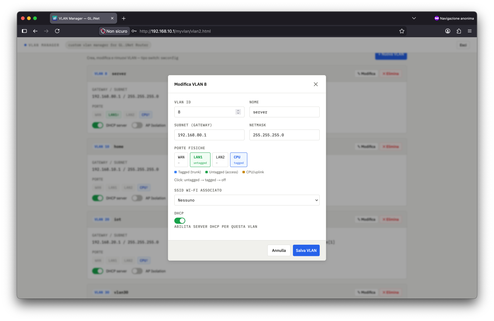
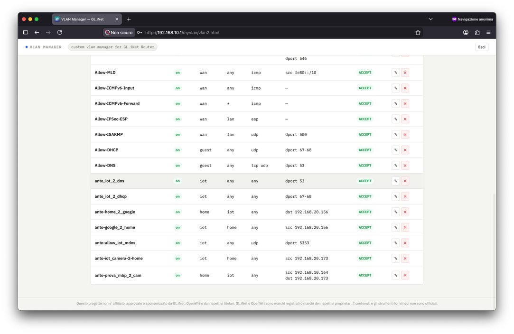

- [Disclaimer](#disclaimer)
- [Stato del progetto](#stato-del-progetto)
- [Where it all began](#where-it-all-began)
- [Installazione](#installazione)

# Disclaimer

Questo progetto non e' affiliato, approvato o sponsorizzato da GL.iNet, OpenWrt o dai rispettivi titolari.
GL.iNet e OpenWrt sono marchi registrati o marchi dei rispettivi proprietari. I contenuti, gli script e l'interfaccia forniti in questo repository non sono ufficiali.

# Stato del progetto

Questa applicazione e' ancora in sviluppo. Non tutte le funzioni sono state testate su tutti i firmware, modelli o configurazioni supportate; alcune operazioni potrebbero non funzionare correttamente o produrre risultati inattesi. Prima di applicare modifiche al router, effettuare un backup della configurazione.

# Where it all began

where it all began: [https://github.com/myblacksloth/GL.iNet--flint2--VLANs](http://https://github.com/myblacksloth/GL.iNet--flint2--VLANs "https://github.com/myblacksloth/GL.iNet--flint2--VLANs")

# Installazione

```bash
ssh -o HostKeyAlgorithms=+ssh-rsa -o PubkeyAcceptedKeyTypes=+ssh-rsa root@192.168.10.1

scp -O -o HostKeyAlgorithms=+ssh-rsa -o PubkeyAcceptedKeyTypes=+ssh-rsa vlan-api.cgi root@192.168.10.1:/www/cgi-bin/vlan-api

chmod +x vlan-api


# scp vlan-manager.html root@192.168.8.1:/www/myvlan/vlan.html
scp -O -o HostKeyAlgorithms=+ssh-rsa -o PubkeyAcceptedKeyTypes=+ssh-rsa vlan-manager.html root@192.168.10.1:/www/myvlan/vlan.html
# accedi su http://192.168.10.1/myvlan/vlan.html


```


